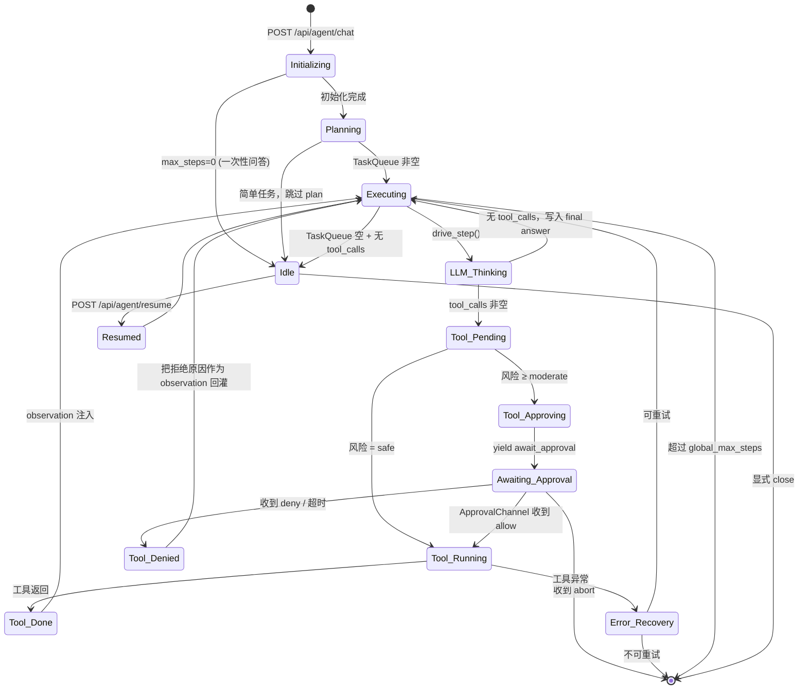

# Agent 升级重构技术方案与执行计划

> 文档作者: Principal AI Architect
> 日期: 2026-04-26
> 范围: 将 `python/src/agent/` 现有 ReAct 聊天 Agent 升级为 Claude Code 风格的「自主型工作流 Agent (Autonomous Workspace Agent, AWA)」
> 关联: `DIAGNOSIS.md` 已诊断的 Q3（Agent 子系统过度设计与实际能力错配）— 本方案在保留 Phase 1–4 既有产物（context_compressor / memory / hooks / skill_system）的前提下，针对其「能力错配」的根因——**仅能输出文本、无法操作环境**——做新一轮重构。
> 不在范围: DIAGNOSIS 已列的 C1–C4 / H1–H6 / M1–M7 修复（这些是阻塞依赖，不是本方案产物）。

---

## 0. TL;DR

现有 Agent 是「一问一答的对话机器人」：它能调用工具、能压缩上下文、能记忆、能 Plan-and-Execute，但所有产出最终都是 **文本回到 SSE 流**。即便 Phase 4 已经引入了 `read_file / write_file / shell_exec / python_exec`，这些工具的沙箱在 `~/scholar_agent_files`（与用户当前工作的项目目录无关），且没有局部编辑、目录扫描、AST 替换、Git、备份、审批等能力——仍然不是「能在工作区里干活的 Agent」。

要变成 Claude Code 那样的工作流 Agent，需要从以下四点根上动：

1. **工作区抽象 (Workspace Environment)** — 把 Agent 的"世界"从 `~/scholar_agent_files` 切到调用方传入的「项目目录」，并以此为根做所有路径校验、备份、Git 操作。
2. **任务状态机 (Task State Machine)** — 把 `AgentLoop.run()` 这个一次性的 `for step in range(MAX_STEPS):` 协程，改成可暂停、可恢复、可分支的 `AgentSession` + `TaskQueue`。
3. **新的 SSE 协议 (Event Protocol v2)** — 区分 `thought / tool_call / tool_result / await_approval / done`，并加入 **审批回流通道**（前端 → 后端的 ApprovalDecision）。
4. **安全闸门 (Security Gates)** — 文件写入、Shell 命令、Git 操作三类破坏性动作必须经过 **Backup → Approval → Execute → Audit** 四步管道。

整个升级以 4 个 Phase 落地，每个 Phase 都是 **可独立验收的闭环**，不破坏 v0.3.2 的现有 `/api/chat` 流。

---

## 1. Architecture Evolution（架构对比）

### 1.1 现有 ReAct 架构的具体限制（基于源码实证，不空谈）

| # | 现存问题 | 源码位置 / 证据 | 后果 |
|---|----------|------------------|------|
| L1 | **MAX_STEPS = 10 写死，且超出即 abort**，没有"用户介入再继续"的概念 | `agent.py:77` 与 `agent.py:602–607` | 任何稍复杂任务（多文件改造、跨文件搜索）都会在第 10 步被强制终止，前端只能拿到 `error` |
| L2 | **`AgentLoop.run()` 是一次性 AsyncGenerator**，没有 session 概念 | `agent.py:277` | 用户断网、刷新页面、切标签 → 整个推理上下文丢失，无法接续 |
| L3 | **`_format_error_retry` 等状态挂在实例上**，并发请求互相污染 | `agent.py:312`, `agent.py:1194` | 单实例模式（`_get_agent` lazy singleton, `routers/agent.py:64`）下，两个用户同时发请求会互相覆盖标志位 |
| L4 | **Plan-and-Execute 名实不符** —— 计划只是被塞进 system message 文本（`agent.py:347–351`），LLM 不被强制按步执行，也没有"当前在第几步"的状态 | `agent.py:840–872` | "执行计划"形同虚设，LLM 仍然每轮自由发挥；多步任务退化为常规 ReAct |
| L5 | **工具沙箱根目录 `~/scholar_agent_files` 与项目无关** | `tools.py:570` (`_SANDBOX_ROOT`) | Agent "看不见" 当前 IDE 打开的项目；要修改用户项目里的文件，需要用户先把文件复制进沙箱 |
| L6 | **没有 `str_replace`、`list_directory`、`apply_patch` 等局部编辑能力**，只有整文件 `_save_file` | `tools.py:592` | 改一行文档 = 让 LLM 把整篇文章重新写一遍 → 浪费 token、易引入幻觉、易破坏未提及的部分 |
| L7 | **无审批通道**：所有 `_save_file / _shell_exec / _python_exec` 直接执行 | `tools.py` 全文无 await_approval 路径 | 无法实现 Claude Code 的 `Allow / Allow once / Deny` 弹窗；危险操作只能靠前置白名单兜底 |
| L8 | **无备份与 Undo**：`_save_file` 直接 `safe_path.write_text(...)` 覆盖 | `tools.py:602` | 一旦 LLM 写坏，原内容永久丢失；与 Claude Code 的 "ESC to revert" 体验差距大 |
| L9 | **重 IO 工具的上下文隔离机制（`vram_manager.py`）耦合在 `agent.py:528–591` 主循环里**，使主循环肿胀 | `agent.py:528–591` | 加任何新的执行模式都得修改主循环；`run()` 已 470+ 行 |
| L10 | **SSE 事件类型贫乏**：只有 `thinking / token / tool_result / response / error`（见 `models.py:64`）；没有 `tool_call`（前端无法区分 "Agent 正在调工具" vs "Agent 正在想"），没有 `await_approval`，没有 `done` | `models.py:64`, `routers/agent.py:193–201` | 前端 UI 无法精细化展示，只能"流式打字"的笼统形态 |
| L11 | **`for step` 主循环和 hooks 触发深度耦合**：每步都要 `await self.hooks.trigger(...)` 七次 | `agent.py:371–426` 之间 | hooks 系统已用，但插入一个新阶段（如审批等待）需要跨 12 处改 hook 触发 |
| L12 | **错误 abort 即销毁状态**：`max_steps` 超出后 `messages` 不被持久化 | `agent.py:602–607` | 长任务失败后无法 resume，要重头再来 |

### 1.2 升级目标：核心组件清单

```
┌─────────────────── AWA 顶层架构 ───────────────────┐
│                                                    │
│  ┌─────────────────┐      ┌─────────────────────┐  │
│  │ AgentSession    │◀────▶│  WorkspaceEnv       │  │
│  │ (持久状态)       │      │  (项目根 + 备份目录) │  │
│  └─────────────────┘      └─────────────────────┘  │
│         │                          ▲               │
│         ▼                          │               │
│  ┌─────────────────┐      ┌─────────────────────┐  │
│  │ TaskQueue       │◀────▶│  BashSessionManager │  │
│  │ (拆解后的子任务) │      │  (持久 shell)       │  │
│  └─────────────────┘      └─────────────────────┘  │
│         │                          ▲               │
│         ▼                          │               │
│  ┌─────────────────┐      ┌─────────────────────┐  │
│  │ AgentLoop v2    │─────▶│  SecurityGate       │  │
│  │ (ReAct 内核)     │      │  (审批 + 黑白名单)   │  │
│  └─────────────────┘      └─────────────────────┘  │
│         │                          ▲               │
│         ▼                          │               │
│  ┌─────────────────┐      ┌─────────────────────┐  │
│  │ EventBus        │─────▶│  ApprovalChannel    │  │
│  │ (SSE v2 + 审批) │◀─────│  (前端→后端回流)      │  │
│  └─────────────────┘      └─────────────────────┘  │
│                                                    │
│  既有可复用：Compressor / Memory / Skill / Hooks   │
└────────────────────────────────────────────────────┘
```

| 组件 | 职责 | 与现有代码的关系 |
|------|------|-------------------|
| **AgentSession** | 一次完整任务的会话对象：携带 messages、TaskQueue、step 计数、approval 状态、生命周期 | 新建 `python/src/agent/session.py` |
| **WorkspaceEnv** | 把"项目根目录"作为一等公民：路径校验、`.agent_backup/` 备份、读写白名单、`.gitignore` 兼容 | 新建 `python/src/agent/workspace.py`；`tools.py` 中 `_SANDBOX_ROOT` 全部替换 |
| **TaskQueue** | 任务拆解结果（来自 plan 或 LLM），每个 Task 有 `pending / running / done / blocked` 状态 | 新建 `python/src/agent/task_queue.py` |
| **TaskPlanner** | 比当前 `_generate_plan()` 强：输出结构化 JSON 而非自由文本，写入 TaskQueue | 替换 `agent.py:840–872` |
| **BashSessionManager** | 通过 `pexpect`（Unix）/ `pywinpty`（Windows）维持一个长连 shell，多次 `run_command` 共享 cwd 和 env | 新建 `python/src/agent/bash_session.py`；`_shell_exec`（一次性 subprocess）保留为兼容入口 |
| **SecurityGate** | 工具调用前的统一闸门：判定操作风险 → 备份（如需）→ 触发审批（如需）→ 放行 | 新建 `python/src/agent/security_gate.py` |
| **EventBus + Event v2** | 替换现有 SSE 事件枚举，新增 `tool_call / await_approval / done` | 改 `models.py:AgentEvent` 增加 `event_id` 字段；改 `routers/agent.py` |
| **ApprovalChannel** | 前端 → 后端的 `POST /api/agent/approve/{event_id}` 回流通道 | 新增路由 + `asyncio.Future` 等待机制 |
| **ChangeJournal / Undo** | 每次写入产生一个 patch 条目，存 `.agent_backup/journal.jsonl` | 新建 `python/src/agent/change_journal.py` |

### 1.3 对比表（升级前 vs 升级后）

| 维度 | 升级前（v0.3.2） | 升级后（AWA v0.4.x） |
|------|-------------------|----------------------|
| **执行单元** | `AgentLoop.run()` 单生成器 | `AgentSession` + `TaskQueue` 状态机 |
| **最大步数** | 写死 10 步 | 单任务 50 步 + 全局 200 步软上限 + `await_approval` 中断 |
| **任务恢复** | 不可恢复（断流即丢） | `session_id` 持久化，`POST /api/agent/resume/{session_id}` 续跑 |
| **沙箱根** | `~/scholar_agent_files` | 调用方传入的项目根 + 显式 `allowed_dirs` 白名单 |
| **文件编辑** | 整文件 `write_text` 覆盖 | `read_file / list_directory / str_replace / write_file / apply_patch` 五件套 |
| **Shell 执行** | 一次性 `subprocess.run`，每条命令重新建进程 | 持久 `BashSessionManager`，cwd 跨命令保留；危险命令进 `SecurityGate` |
| **Git 集成** | 无（git 走 `_shell_exec` 白名单） | 独立 `git_op` 工具 + Git Hook（每次写入前 `git stash` 隐式备份） |
| **审批** | 全部直放 | `ToolRiskLevel` 分级：safe 直放 / moderate 询问一次 / destructive 强制审批 |
| **备份与 Undo** | 无 | `.agent_backup/<ts>/<path>.bak` + `journal.jsonl`；`undo_last_change` 工具 |
| **SSE 事件** | thinking / token / tool_result / response / error | 上述 + `tool_call` / `await_approval` / `task_started` / `task_done` / `done` / `warning` |
| **状态污染** | 实例级 `_format_error_retry` 等被共享 | 全部移入 `AgentSession`，每会话独立 |
| **并发** | 单 `_agent_instance` 单例 | `AgentSession` 池 + LLM HTTP 客户端共享 |
| **可观测性** | 仅 logger | EventBus 同时写 `trajectory.jsonl` + Prometheus 指标钩子（可选） |

### 1.4 与既有 Phase 1–4 模块的复用边界

**直接复用（不改）**：
- `context_compressor.py`：AgentLoop v2 仍每步调用一次 `compress()`
- `memory.py:MemoryManager`：注入 system prompt 不变，新增 session 级写入
- `hooks.py`：保留 12 个 HookPoint，**新增** `ON_APPROVAL_REQUEST / ON_APPROVAL_RESPONSE / ON_TASK_START / ON_TASK_COMPLETE` 4 个
- `skill_system.py / trajectory.py`：保留，TrajectoryRecorder 移入 AgentSession
- `error_classifier.py / RetryManager`：保留

**重构（改造，不重写）**：
- `agent.py:AgentLoop`：拆出 `_call_llm_streaming` 系列方法到独立 `llm_client.py`；主循环精简为 `step()` 协程，由 `AgentSession.drive()` 反复调用
- `tools.py`：`_SANDBOX_ROOT` 改为从 `WorkspaceEnv.get_root()` 拿；新增 5 个文件工具

**淘汰**：
- `vram_manager.py:MultiplexingScheduler` 中的 PLANNER/ACTOR 切换逻辑（KV cache flush）— **保留**模型 acquire/release，**移除**主循环里的 `is_heavy_tool` 分支（让 BashSessionManager 自己处理隔离）
- `agent.py:_generate_plan()` 的自由文本计划 — 由 `TaskPlanner.plan_to_queue()` 替代

---

## 2. New Toolchain Design（新工具链设计）

> 命名约定：与 Claude Code 对齐使用 snake_case；返回值统一为 **结构化 JSON 字符串**（而非现有 tools.py 的纯文本），让前端能精确渲染 diff/file tree/exit code。

### 2.1 `read_file`

```python
@tool
def read_file(
    file_path: str,
    *,
    offset: int = 0,
    limit: int | None = None,
    encoding: str = "utf-8",
) -> str:
    """读取项目工作区内的文件，返回带行号的内容。

    输入:
        file_path: 相对项目根的路径（绝对路径若在项目根内也接受），如 "src/agent/agent.py"。
        offset: 起始行号（1-indexed），默认 1。
        limit: 最多读取行数，None 表示读到结尾；硬上限 2000 行。
        encoding: 文件编码，默认 utf-8。

    输出: JSON 字符串
        {
          "file_path": "src/agent/agent.py",
          "total_lines": 1962,
          "returned_lines": [1, 500],
          "content": "  1\tclass AgentLoop:\n  2\t    ...\n",
          "truncated": true
        }

    安全限制:
      - 必须落在 WorkspaceEnv.allowed_dirs 内
      - 拒绝 ".env" / "*.key" / "*.pem" 等敏感后缀（沿用 api_factory._DENIED_EXTENSIONS）
      - 二进制文件检测：前 4096 字节含 NUL → 拒绝
      - limit 硬上限 2000 行（与 Claude Code Read 工具一致）
    """
```

### 2.2 `list_directory`

```python
@tool
def list_directory(
    path: str = ".",
    *,
    pattern: str | None = None,
    recursive: bool = False,
    max_entries: int = 200,
) -> str:
    """列出目录内容，返回带类型和大小的结构。

    输入:
        path: 相对项目根的目录路径，默认根目录。
        pattern: glob 过滤（如 "*.py"），None 表示不过滤。
        recursive: 是否递归（递归时尊重 .gitignore）。
        max_entries: 最大返回条目数（防 token 爆炸）。

    输出: JSON 字符串
        {
          "path": "src/agent",
          "entries": [
            {"name": "agent.py", "type": "file", "size": 78421, "mtime": "2026-04-25T..."},
            {"name": "tools.py", "type": "file", ...},
            {"name": "__pycache__", "type": "dir", "size": null}
          ],
          "truncated": false
        }

    安全限制:
      - WorkspaceEnv.allowed_dirs 校验
      - recursive=True 时强制读取 .gitignore；命中即跳过（防遍历 node_modules）
      - max_entries 硬上限 1000
    """
```

### 2.3 `str_replace`

```python
@tool
def str_replace(
    file_path: str,
    old_string: str,
    new_string: str,
    *,
    replace_all: bool = False,
) -> str:
    """精确字符串替换（与 Claude Code Edit 工具语义一致）。

    输入:
        file_path: 目标文件相对路径
        old_string: 待替换的精确字符串（含缩进、换行）
        new_string: 替换后的字符串
        replace_all: True 时替换所有出现；False（默认）时要求 old_string 唯一

    输出: JSON 字符串
        {
          "file_path": "src/agent/agent.py",
          "occurrences": 1,
          "diff": "@@ -100,3 +100,5 @@\n ...",
          "backup_id": "bak_20260426_103022_a1b2"
        }

    安全限制:
      - WorkspaceEnv.allowed_dirs 校验
      - replace_all=False 且 old_string 出现 0 次 → 报错 "not found"
      - replace_all=False 且 old_string 出现 ≥2 次 → 报错 "ambiguous, use replace_all=True or expand context"
      - 写入前 SecurityGate 处理：destructive=true → 触发 await_approval
      - 写入前自动创建备份到 .agent_backup/<backup_id>/<file_path>.bak
      - 写入后追加 ChangeJournal 条目
    """
```

### 2.4 `write_file`

```python
@tool
def write_file(
    file_path: str,
    content: str,
    *,
    must_not_exist: bool = False,
) -> str:
    """整文件写入（仅用于新建文件或全量重写）。

    输入:
        file_path: 目标文件相对路径
        content: 完整内容
        must_not_exist: True 时若文件已存在则报错（防误覆盖）

    输出: JSON 字符串
        {
          "file_path": "docs/new.md",
          "size": 1234,
          "created": true,
          "backup_id": "bak_20260426_103022_a1b2"
        }

    安全限制:
      - 强制走 SecurityGate，destructive=true
      - 已存在文件被覆盖时强制审批（不可"once approved 永久放行"）
      - 与 str_replace 共用 backup 机制
      - LLM 倾向用 write_file 一把梭 → SecurityGate 检测：若文件已存在且大小 > 200 行，prompt LLM "考虑使用 str_replace"（warning 事件，但不阻止）
    """
```

### 2.5 `run_command`

```python
@tool
def run_command(
    command: str,
    *,
    timeout: int = 120,
    cwd: str | None = None,
    persist_session: bool = True,
) -> str:
    """在持久 BashSessionManager 中执行 shell 命令。

    输入:
        command: 命令字符串
        timeout: 超时秒（硬上限 600）
        cwd: 工作目录相对项目根，None 表示沿用上次 cwd
        persist_session: True 时复用同一 session（环境变量、cd 跨命令保留）

    输出: JSON 字符串
        {
          "command": "pytest tests/ -v",
          "exit_code": 0,
          "stdout": "...",
          "stderr": "...",
          "duration_ms": 12345,
          "cwd_after": "/path/to/project",
          "truncated": false
        }

    安全限制:
      - 命令首词进黑名单：rm -rf /, curl <外网>, wget, scp, ssh, sudo, su, chmod 777, dd, mkfs, shutdown, reboot
      - 命令首词进白名单（safe）：ls, cat, grep, find, git, python, pytest, npm, npx, cargo, rustc, node
      - 不在 safe 白名单 ⇒ ToolRiskLevel.MODERATE → 触发 await_approval
      - 黑名单命中 ⇒ 直接 deny，记 ChangeJournal warning
      - 命令包含 shell 元字符（&, |, ;, > /dev/, $(...)）⇒ ToolRiskLevel.MODERATE
      - 工作目录强制 startswith(WorkspaceEnv.root)
      - timeout 硬上限 600s
      - HTTP_PROXY 等环境变量在 spawn 时清空（沿用 start_dev.bat 的兼容做法，CLAUDE.md 已记载）
    """
```

### 2.6 `git_op`

```python
@tool
def git_op(
    operation: str,
    *,
    args: dict | None = None,
) -> str:
    """受控 git 操作。比直接走 run_command 多一层语义校验和审批策略。

    输入:
        operation: 操作名，仅支持 status / diff / log / show / branch /
                   stash / commit / restore / add / checkout
        args: 操作参数字典（按 operation 不同含义不同）
              - commit: {"message": "...", "files": ["a.py", "b.py"]}
              - diff: {"path": "a.py" | None, "staged": false}
              - restore: {"path": "a.py", "source": "HEAD"}

    输出: JSON 字符串
        {
          "operation": "diff",
          "exit_code": 0,
          "data": {...}    // 解析后的结构化数据，比 run_command 返回 raw stdout 更易消费
        }

    安全限制:
      - 仅允许枚举内的 operation；其余 op（push/pull/reset/rebase/merge）不暴露
      - 危险 op：reset --hard, checkout -- . , clean -fd → 永久禁止
      - destructive op：restore, checkout (切分支), commit → 强制审批
      - 所有 op 在工作区根执行
      - 不允许 --no-verify / --no-gpg-sign（沿用 Claude Code 系统提示风格）
    """
```

### 2.7 `undo_last_change`

```python
@tool
def undo_last_change(
    *,
    count: int = 1,
    backup_id: str | None = None,
) -> str:
    """回退最近 N 次破坏性操作。

    输入:
        count: 回退次数（仅 backup_id 为 None 时生效）
        backup_id: 指定回退到某个 backup 点（与 count 互斥）

    输出: JSON 字符串
        {
          "reverted": [
            {"backup_id": "bak_...", "file_path": "src/agent/agent.py", "operation": "str_replace"},
            ...
          ],
          "count": 1
        }

    安全限制:
      - 仅消费 .agent_backup/journal.jsonl 中的条目
      - 强制审批（reverting 也是 destructive）
      - 回退后向 journal.jsonl 追加 "undo" 条目（可被再次 undo）
    """
```

### 2.8 工具风险分级总览

| 工具 | 风险级别 | 默认审批策略 |
|------|---------|--------------|
| `read_file`, `list_directory` | safe | 直放 |
| `str_replace`, `write_file` | destructive | 每次审批 |
| `run_command` (白名单首词) | safe | 直放 |
| `run_command` (其他/含元字符) | moderate | 每次审批，可"本会话内允许" |
| `run_command` (黑名单首词) | banned | 直接拒绝 |
| `git_op` (status/diff/log/show/branch) | safe | 直放 |
| `git_op` (commit/restore/checkout/add/stash) | destructive | 每次审批 |
| `undo_last_change` | destructive | 每次审批 |

> **注**：审批粒度学 Claude Code，前端可选 `Allow once / Allow this session / Deny`。"Allow this session" 写入 `AgentSession.approved_categories`。

---

## 3. Loop & State Refactoring（循环与状态机重构）

### 3.1 状态机设计（Mermaid）



### 3.2 主循环重构：从 `for step` 到 `AgentSession.drive()`

**当前**（`agent.py:365`）：
```python
for step in range(1, self.max_steps + 1):
    response = await self._call_llm_streaming(messages)
    tool_calls = self._extract_tool_calls(response)
    if not tool_calls: return final
    for tc in tool_calls:
        result = await self._execute_single_tool(tc, query)
        messages.append(...)
```

**重构后**（`session.py`）：
```python
class AgentSession:
    def __init__(self, session_id, workspace, loop, ...):
        self.id = session_id
        self.state: SessionState = SessionState.INITIALIZING
        self.task_queue = TaskQueue()
        self.messages: list[Message] = []
        self.global_step = 0          # 跨任务全局步数
        self.task_step = 0            # 当前任务内步数
        self.pending_approvals: dict[str, asyncio.Future] = {}
        self.approved_categories: set[str] = set()  # session-scoped
        self.change_journal = ChangeJournal(...)

    async def drive(self) -> AsyncGenerator[AgentEvent, None]:
        """对外的事件流。每次 yield 一个事件；遇到 await_approval 时挂起到 Future。"""
        try:
            yield from self._run_planner()         # → 写入 task_queue
            while self.task_queue.has_pending():
                task = self.task_queue.next()
                async for ev in self._drive_task(task):
                    yield ev
            yield AgentEvent(type="done", content="all tasks complete", ...)
        except SessionAborted:
            yield AgentEvent(type="aborted", ...)

    async def _drive_task(self, task: Task) -> AsyncGenerator[AgentEvent, None]:
        """单个任务内的 ReAct 循环。"""
        self.task_step = 0
        while self.task_step < TASK_MAX_STEPS and self.global_step < GLOBAL_MAX_STEPS:
            self.task_step += 1
            self.global_step += 1
            response = ... # _call_llm_streaming
            tool_calls = self._extract_tool_calls(response)

            yield AgentEvent(type="thought", content=self._extract_text(response), ...)

            if not tool_calls:
                yield AgentEvent(type="task_done", content=task.id, ...)
                return

            for tc in tool_calls:
                gate = SecurityGate.classify(tc, self.workspace)
                yield AgentEvent(type="tool_call", content="", metadata={
                    "event_id": ev_id, "tool": tc.name, "args": tc.arguments,
                    "risk": gate.risk_level,
                })
                if gate.needs_approval(self.approved_categories):
                    decision = await self._wait_approval(ev_id)
                    if decision == "deny":
                        observation = "user denied"
                    else:
                        observation = await self._execute_with_backup(tc, gate)
                else:
                    observation = await self._execute_with_backup(tc, gate)

                yield AgentEvent(type="tool_result", content=observation, ...)
                self.messages.append(...)

    async def _wait_approval(self, event_id: str) -> str:
        fut = asyncio.Future()
        self.pending_approvals[event_id] = fut
        try:
            return await asyncio.wait_for(fut, timeout=APPROVAL_TIMEOUT)  # 600s
        except asyncio.TimeoutError:
            return "deny"
        finally:
            self.pending_approvals.pop(event_id, None)
```

**关键变化**：
1. `_format_error_retry` 等所有 instance state 移入 `AgentSession`
2. 主循环精简到 ~80 行；现有 `_call_llm_*` 全部抽到 `llm_client.py`
3. `vram_manager` 的 PLANNER/ACTOR 切换从主循环移除；如需重 IO 隔离，由 `BashSessionManager` 在执行 `run_command(timeout > 60s)` 时自己处理
4. `pending_approvals` 是 `asyncio.Future` 字典；由 `POST /api/agent/approve/{event_id}` 的 handler `set_result()` 解锁

### 3.3 SSE 事件协议 v2

| 事件类型 | 何时发出 | payload 示例 |
|----------|---------|--------------|
| `session_started` | drive 入口 | `{"session_id": "sess_...", "workspace_root": "/path/to/proj"}` |
| `task_started` | TaskQueue 取出新 task | `{"task_id": "t_1", "title": "重构 agent.py 主循环", "index": 1, "total": 5}` |
| `thought` | 每次 LLM 响应（替换原 `thinking`） | `{"step": 3, "content": "我需要先看一下当前的 ..."}` |
| `token` | 流式 token | `{"delta": "..."}` |
| `tool_call` | 准备执行工具 | `{"event_id": "evt_xyz", "tool": "str_replace", "args": {...}, "risk": "destructive"}` |
| `await_approval` | risk ≥ moderate 时发出，等前端响应 | `{"event_id": "evt_xyz", "tool": "...", "preview": {"diff": "..."}, "timeout_ms": 600000}` |
| `approval_received` | 收到前端审批后回放 | `{"event_id": "evt_xyz", "decision": "allow_once"}` |
| `tool_result` | 工具执行完毕 | `{"event_id": "evt_xyz", "tool": "str_replace", "success": true, "duration_ms": 42, "result": {...}}` |
| `task_done` | 单任务完成 | `{"task_id": "t_1", "status": "ok"}` |
| `warning` | 非致命提醒（如建议改用 str_replace 而非 write_file，覆盖既有 H3 翻译降级警告) | `{"code": "PREFER_STR_REPLACE", "message": "..."}` |
| `error` | 不可恢复错误 | `{"error_type": "...", "message": "..."}` |
| `done` | 全部任务结束（替换原 `response`） | `{"summary": "...", "token_usage": {...}, "tasks_done": 5}` |
| `aborted` | 用户主动 abort | `{"reason": "user_abort"}` |

**审批回流**：
```
POST /api/agent/approve/{session_id}/{event_id}
Body: {"decision": "allow_once" | "allow_session" | "deny", "reason"?: "..."}
```

后端 handler：
```python
@app.post("/api/agent/approve/{session_id}/{event_id}")
async def approve(session_id: str, event_id: str, body: ApprovalRequest):
    session = session_pool.get(session_id) or 404
    fut = session.pending_approvals.get(event_id) or 404
    if body.decision == "allow_session":
        session.approved_categories.add(...)
    fut.set_result(body.decision)
    return {"status": "ok"}
```

### 3.4 与 hooks.py 的兼容

新增 4 个 HookPoint，**完全不动**现有 12 个：
```python
class HookPoint(Enum):
    # ... 现有 12 个保留
    ON_APPROVAL_REQUEST = auto()    # 在 yield await_approval 之前
    ON_APPROVAL_RESPONSE = auto()   # 收到前端 decision 后
    ON_TASK_START = auto()          # 取出 task 时
    ON_TASK_COMPLETE = auto()       # 单任务 done
```

`AgentSession.drive()` 在状态机各节点照常 `await self.hooks.trigger(...)`。

---

## 4. Security & Sandboxing（安全与沙箱）

### 4.1 权限模型实现

```python
# python/src/agent/workspace.py
@dataclass(frozen=True)
class WorkspaceEnv:
    root: Path                          # 项目根（必填，从 /api/agent/chat 请求传入）
    allowed_dirs: tuple[Path, ...]      # 默认 = (root,)；可显式扩展（如 ~/.zotero）
    denied_globs: tuple[str, ...] = (
        ".env", ".env.*", "*.key", "*.pem", "*.p12", "*.pfx",
        ".git/objects/**", "node_modules/**", ".venv/**",
    )
    max_file_bytes: int = 5_000_000    # 单文件 5MB 上限

    def resolve(self, p: str) -> Path:
        """把外部传入路径校验后映射到 root 内的绝对路径。"""
        candidate = Path(p) if Path(p).is_absolute() else (self.root / p)
        resolved = candidate.resolve()
        if not any(self._is_within(resolved, base) for base in self.allowed_dirs):
            raise WorkspaceViolation(f"path outside workspace: {p}")
        for pat in self.denied_globs:
            if resolved.match(pat) or any(parent.match(pat) for parent in resolved.parents):
                raise WorkspaceViolation(f"path matches denied glob {pat}: {p}")
        return resolved

    @staticmethod
    def _is_within(path: Path, base: Path) -> bool:
        try:
            path.relative_to(base)
            return True
        except ValueError:
            return False
```

接入点：
- `tools.py`：所有文件类工具的第一行 `path = workspace.resolve(file_path)`
- `BashSessionManager`：spawn 时 `cwd=workspace.root`；不允许 `cd` 到 root 之外（每次 `run_command` 后比对 `cwd_after`）
- `git_op`：所有 `git` 调用都 `--git-dir=<workspace.root/.git>` 显式锁定

### 4.2 `.agent_backup/` 备份机制

**目录结构**：
```
<workspace.root>/.agent_backup/
├── journal.jsonl                 # 全部操作的时间线（追加写）
├── 20260426_103022_a1b2/         # 每次 destructive 操作一个目录
│   ├── meta.json                 # {tool, args, file, original_sha256}
│   └── files/
│       └── src/agent/agent.py.bak
├── 20260426_103105_c3d4/
│   └── ...
```

**备份策略**：

| 操作 | 备份动作 |
|------|----------|
| `str_replace`, `write_file`（已存在文件） | `cp <file> .agent_backup/<bid>/files/<rel>.bak` 后再写 |
| `write_file`（must_not_exist） | 不备份（无原内容） |
| `run_command` (destructive) | 在执行**之前** `git stash push -u -m "agent:<event_id>"`；记录 stash 编号 |
| `git_op restore/checkout/reset` | 同上 |

**journal.jsonl 单条记录**：
```json
{
  "ts": "2026-04-26T10:30:22Z",
  "session_id": "sess_abc",
  "event_id": "evt_xyz",
  "backup_id": "20260426_103022_a1b2",
  "tool": "str_replace",
  "file": "src/agent/agent.py",
  "operation": "edit",
  "original_sha256": "...",
  "new_sha256": "...",
  "diff_preview": "@@ -100,3 +100,5 @@ ...",
  "undone_at": null
}
```

### 4.3 Undo 机制

- **回退粒度**：单个 `event_id`（即一次 `str_replace` / `write_file` / `run_command`）
- **存储**：`.agent_backup/journal.jsonl` 由后到前扫描
- **触发方式**：
  - 工具：`undo_last_change(count=1)` 由 LLM 主动调用
  - HTTP：`POST /api/agent/undo/{session_id}` 由用户从前端按钮触发
  - SSE：用户直接发 `abort` + `revert_session=true` 的请求体，后端遍历 journal 回退所有未 `undone_at` 的条目
- **回退实现**：把 `<bid>/files/<rel>.bak` 还原；run_command 类则 `git stash pop`

### 4.4 危险操作熔断

**多层防御**（按调用顺序）：

1. **静态黑名单**（`SecurityGate.classify` 入口）：命中 `rm -rf /`, `sudo`, `dd`, 黑名单 git 子命令 → 直接返回 `risk=banned`，根本不进 LLM 视野
2. **风险升级**（启发式）：
   - 单次 `str_replace` 删除 > 50 行 → moderate 升 destructive
   - `run_command` 包含管道/重定向/反引号 → 强制 moderate
   - 同会话内同一文件 5 分钟内被改 ≥ 3 次 → 强制 moderate（防 LLM 反复改坏一个文件）
3. **审批超时**（`APPROVAL_TIMEOUT = 600s`）：超时即视作 deny
4. **全局熔断器**（`AgentSession.global_step >= 200` 或 `consecutive_errors >= 5`）：暂停 session，写 `error` 事件 + 终止 drive；用户必须显式 resume
5. **写入循环检测**：connection journal，如果 5 分钟内对同一文件出现 "write → undo → write" 模式 ≥ 2 次 → 熔断
6. **Hook 二次审计**：`ON_TOOL_CALL` 钩子点提供给用户自定义代码插入额外校验（如某些公司想强制 Code Review LLM 在 commit 前再审一遍）

---

## 5. Execution Roadmap（分步执行计划）

> 关键约束：**不破坏 v0.3.2 现有 `/api/chat` 流**。新接口走 `/api/agent/v2/*`，待 Phase 4 稳定后再切换默认。
>
> 与 DIAGNOSIS.md 的依赖：
> - Phase 1 **不能开工**直到 **C1（API Key 轮换）+ L1（gitignore）** 完成 — 否则任何 agent 演示都会暴露密钥
> - Phase 1 **强烈建议**等 **C3（SQLite WAL）** — 否则新增的 `change_journal` 写入会加剧 `database is locked`
> - Phase 2 的事件协议改动 **必须** 在 **C4（SSE reader cancel）+ Q2（streamReader 抽象）** 之后做 — 否则前端 6 处 SSE reader 都得改两次
> - Phase 3 的 BashSessionManager **依赖** **C2（_busy_lock 竞态修复）** — 同一思路（async lock try_acquire）会复用到 BashSession 池
> - Phase 3 的审批回流端点 **依赖** **H5（输入长度限制）** — 共用同一 middleware
> - Phase 4 的 session 持久化 **建议** 在 **L7（rate limit）** 之后 — 否则 session_pool 易被打爆

### Phase 1: Workspace Foundation + 局部编辑工具（2 周）

**目标**：让 Agent 能在真实项目目录里读、列、改文件，不动主循环。

**改动文件范围**：
- `python/src/agent/workspace.py`（新增 ~150 行）
- `python/src/agent/change_journal.py`（新增 ~120 行）
- `python/src/agent/tools.py`：
  - 改造现有 `_read_file / _save_file` 接收 `WorkspaceEnv`
  - 新增 `_list_directory / _str_replace / _write_file_v2 / _undo_last_change`
- `python/routers/agent.py`：`ChatRequest` 增加 `workspace_root: str` 字段；`_get_agent` 改为按 workspace_root 维度的多实例缓存
- `python/tests/unit/test_workspace.py`、`test_change_journal.py`、`test_str_replace.py`

**外部依赖**：
- 新增 `python/requirements.txt`：`unidiff`（生成 diff preview）

**与 DIAGNOSIS 的依赖**：阻塞于 C1 / L1（API Key 处理）。建议同期推进 C3。

**验收标准**（每条都要可自动化）：
1. `pytest tests/unit/test_workspace.py` 全绿，覆盖：路径逃逸、`.env` 拦截、跨 allowed_dirs
2. 手动场景：在 `D:\pycharm_study\translator` 下启 dev，调 `POST /api/agent/v2/tool/str_replace`，传入 `{"file_path":"CLAUDE.md", "old_string":"Tauri 0.3.1","new_string":"Tauri 0.4.0"}`，能成功修改并产生 backup
3. `read_file` 拒绝 `python/.env`（应有 `_DENIED_EXTENSIONS` 行为，参考 api_factory.py:130）
4. `undo_last_change(count=1)` 能精确还原上一步 `str_replace`，且 `journal.jsonl` 出现 `undone_at` 字段
5. 现有 `/api/chat` 行为完全不变（regression：现有 212 个测试仍全绿）

---

### Phase 2: AgentSession 状态机 + Event v2（2 周）

**目标**：把 `AgentLoop.run()` 拆成 `AgentSession.drive()` + `TaskQueue` + 新事件协议；前端能拿到 `tool_call / task_started / done` 等结构化事件。

**改动文件范围**：
- `python/src/agent/session.py`（新增 ~400 行）
- `python/src/agent/task_queue.py`（新增 ~120 行）
- `python/src/agent/llm_client.py`（从 `agent.py` 拆出 `_call_llm_*` / `_stream_*`，~600 行）
- `python/src/agent/agent.py`：精简到 `AgentLoop` 仅做"无状态的单步执行器"，给 `AgentSession.drive()` 调用
- `python/src/agent/models.py`：`AgentEvent.type` 字面量扩充；新增 `event_id` 字段
- `python/routers/agent.py`：新增 `POST /api/agent/v2/chat`（返回 EventSourceResponse v2）；旧 `/api/chat` 保留
- `src/utils/streamReader.ts`：（前置依赖 Q2 已抽出）扩展 `parseEvent` 接受新事件类型
- `src/composables/useAgentChatV2.ts`：新增 v2 客户端
- `src/types/agentEvents.ts`：补全所有事件类型 union
- 测试：`tests/unit/test_session.py`、`tests/unit/test_task_queue.py`、`tests/integration/test_agent_v2_sse.py`

**与 DIAGNOSIS 的依赖**：Phase 2 必须等 **C4 + Q2 完成**，否则前端 6 处都要改两次。Phase 2 自身会**完成** L3（_format_error_retry instance pollution）。

**验收标准**：
1. 旧 `/api/chat` 旧测试仍全绿（向后兼容）
2. 新 `/api/agent/v2/chat` 端到端测试：发送复杂任务（"读 CLAUDE.md，把 Tauri 版本改成 0.4.0，然后给我看 diff"），SSE 流应包含 `task_started → thought → tool_call(read_file) → tool_result → tool_call(str_replace) → tool_result → task_done → done`，无 await_approval（因为 read_file/str_replace 在 dev 模式 auto-allow）
3. 并发 5 个 v2 chat 请求，互相不污染状态（断言每个 session 独立的 task_step 计数）
4. v2 客户端 `useAgentChatV2.ts` 在 `__tests__` 下能 mock SSE 流并正确分派事件
5. `DIAGNOSIS.md L3` (instance state pollution) 被自动化测试覆盖

---

### Phase 3: BashSession + Approval + Backup（2 周）

**目标**：危险操作走审批；shell 命令走持久 session；备份/Undo 端到端可用。

**改动文件范围**：
- `python/src/agent/bash_session.py`（新增 ~250 行；Windows 用 `pywinpty`，Unix 用 `pexpect`）
- `python/src/agent/security_gate.py`（新增 ~180 行）
- `python/src/agent/tools.py`：新增 `_run_command_v2 / _git_op`
- `python/routers/agent.py`：新增 `POST /api/agent/approve/{session_id}/{event_id}`、`POST /api/agent/undo/{session_id}`、`POST /api/agent/abort/{session_id}`
- `src/components/AgentApprovalModal.vue`（新增 ~150 行）：弹窗显示 tool/args/diff 预览，3 个按钮
- `src/composables/useAgentApproval.ts`（新增 ~80 行）：监听 `await_approval` 事件 → 弹窗 → POST decision
- 配置：`config/default.yaml` 新增 `agent.security` 段（黑/白名单可配）
- 测试：`tests/unit/test_security_gate.py`、`tests/unit/test_bash_session.py`、`tests/integration/test_approval_flow.py`

**外部依赖**：
- `python/requirements.txt`：`pywinpty>=2.0; sys_platform=='win32'`、`pexpect>=4.9; sys_platform!='win32'`

**与 DIAGNOSIS 的依赖**：依赖 C2（busy lock 模式）— 因为 BashSession 池是同一并发模式；依赖 H5（input length limit middleware）— ApprovalRequest 也走它。

**验收标准**：
1. 集成测试：发送 `"运行 pytest tests/unit/test_workspace.py 然后告诉我结果"`，前端收到 `await_approval` 事件（因为 pytest 不在白名单），mock 用户点 `allow_once`，POST `/api/agent/approve` 后 SSE 继续，最终 `task_done` 含 stdout
2. 黑名单：构造 LLM 输出 `rm -rf /` → SecurityGate 直接 `tool_result` with error，无 await_approval（避免让用户被诱骗审批）
3. `BashSession` 持久性：连续 `run_command("cd python")` + `run_command("pwd")` → 第二次返回应在 python 子目录
4. Undo 端到端：`str_replace` 改 CLAUDE.md → 调 `/api/agent/undo` → 文件还原 + journal 标记 undone_at
5. 审批超时：模拟前端不响应，600s 后 SSE 流出现 `tool_result` with `decision=deny_timeout`

---

### Phase 4: Long-Running Session + Resume + Observability（2 周）

**目标**：用户刷新/断网后能 resume；session 持久化到 SQLite；TrajectoryRecorder 与新 EventBus 双写；Skill 系统对接 v2 task。

**改动文件范围**：
- `python/src/agent/session_store.py`（新增 ~200 行；SQLite 持久化 AgentSession）
- `python/src/agent/session.py`：增加 `serialize() / deserialize()` + drive 中点 checkpoint
- `python/src/agent/trajectory.py`：增加 `record_event(AgentEvent)`；现有 conversation 接口保留
- `python/src/agent/skill_system.py`：v2 task complete 时触发 skill nudge（已有 `nudge_check` 机制）
- `python/routers/agent.py`：`POST /api/agent/resume/{session_id}`、`GET /api/agent/sessions`
- `src/components/AgentSessionList.vue`（新增 ~120 行）：侧边栏列出未完成 sessions
- 测试：`tests/integration/test_session_resume.py`、`tests/integration/test_session_persistence.py`
- 文档：`docs/agent_v2.md`（新增）

**与 DIAGNOSIS 的依赖**：依赖 L7（rate limit）— session_pool 防止被打爆；依赖 C3（SQLite WAL）已就位。

**验收标准**：
1. 端到端 resume：跑一半的任务（5 个子任务做完 2 个）→ 模拟前端断流（关闭 SSE）→ POST `/api/agent/resume/{session_id}` → SSE 从 `task_started(t_3)` 开始继续
2. 重启服务后仍能 resume：写入 session_store 后 kill API 进程，重启 → session list 仍含未完成 session
3. 轨迹双写：`trajectory.jsonl` 含完整事件流（不只是 sharegpt 对话），可 replay
4. Skill 自动产生：故意构造一个"修复 import 错误"任务连跑 3 次 → 检查 `data/agent/skills/` 出现新 skill markdown
5. 切换 v2 为默认：`/api/chat` 内部转发到 v2；旧 v1 端点改为 `/api/chat/v1`（标 deprecated）

---

### Phase 间总览表

| Phase | 周期 | 行数估算 | 依赖 DIAGNOSIS | 兼容性 | 验收闭环 |
|-------|------|----------|----------------|--------|----------|
| 1 Workspace + 局部编辑 | 2 周 | +700 / -50 | C1, L1（强阻塞）；C3（推荐） | 完全向后兼容 | str_replace + undo 通过 pytest |
| 2 Session + Event v2 | 2 周 | +1500 / -300 | C4, Q2（强阻塞） | v2 端点新增，v1 保留 | 5 并发 v2 SSE 不串污染 |
| 3 BashSession + Approval | 2 周 | +900 / -100 | C2, H5（强阻塞） | 全部走 v2，v1 不动 | 审批回流 + 黑名单熔断 + Undo 端到端 |
| 4 Persistence + Resume | 2 周 | +800 / -50 | C3 已 done; L7（推荐） | v1 内部转发到 v2 | 服务重启后能 resume |

总计 8 周；如人力允许 Phase 1+2 串行，Phase 3+4 可并行（Phase 3 改 BashSession，Phase 4 改 SessionStore，互不冲突）。

---

## 6. 已识别的高风险与开放问题

| 编号 | 风险 | 应对 |
|------|------|------|
| R1 | `pywinpty` 在 Tauri 打包后行为可能异常（PyInstaller 与 native deps） | Phase 3 第一周 spike：先验证打包后能正常 spawn |
| R2 | LLM 写出超长 `old_string` 经常 0 命中或多命中 | 在 SecurityGate 加启发式：失败时自动放宽到 `replace_all` 提示 |
| R3 | 用户审批弹窗疲劳（destructive 太多 → 直接全 allow_session） | UI 设计：`allow_session` 按钮二级确认 + 显示已 allow 的类别清单 |
| R4 | 长 session 的 messages 持续增长，即便有 compressor 也可能爆 | session 级别引入 task 边界 checkpoint：每个 task 完成后强制压缩到 ≤2K tokens |
| R5 | Workspace 切换：用户开两个项目，两个 session 串了 | session_id ↔ workspace_root 一一绑定，路由层校验 |
| R6 | `.agent_backup/` 占用磁盘 | 后台任务：30 天前的 backup_dir 自动清理；超过 1GB 强制清理最旧的 |

---

## 7. 反对意见预演（Devil's Advocate）

> "为什么不直接接入 Claude Code SDK / LangGraph，自己造轮子干嘛？"

A1：我们的核心价值在 **本地 Ollama + Tauri 端侧** 场景；LangGraph 是云原生设计、对本地小模型支持有限；Claude Code 自身不是 SDK 而是 CLI。本方案的 ~80% 组件是项目特有需求（VRAM 隔离、Pandoc PDF、Argument Map），自造可控性更高。

> "MAX_STEPS = 200 全局上限会不会把 Ollama 烧坏？"

A2：白名单工具（read_file/list_directory）每步消耗 ≈3K tokens，200 步上限对应一次会话 ~600K tokens，对 32K 窗口的 Qwen3:8B 完全是流式而非常驻；且 `compressor.compress()` 每步触发，实际驻留 < 16K。真正的瓶颈在 LLM 连续推理时长（每步 5-15s）— 因此**软限**远早于硬限：连续 5 个 `error` 即熔断。

> "Phase 2 把 LLM client 拆出去会不会和 Phase 1 冲突？"

A3：Phase 1 完全不动 `agent.py`；Phase 2 才拆 `_call_llm_*`。Phase 1 的 PR merge 后 Phase 2 直接 rebase 即可。

---

## 8. 附录：关键源码引用

- 现有 ReAct 主循环：`python/src/agent/agent.py:277-616`
- 现有 SSE 事件：`python/src/agent/models.py:64-86`
- 现有路由 SSE 序列化：`python/routers/agent.py:193-206`
- 现有沙箱根：`python/src/agent/tools.py:570`
- 现有路径校验（api 层）：`python/api_factory.py:126-141`
- 现有 hooks 接入点：`python/src/agent/agent.py:371-426`（每步 7 个 await）
- 现有 plan-and-execute（伪）：`python/src/agent/agent.py:840-872`
- VRAM 调度（拟移除主循环依赖）：`python/src/agent/vram_manager.py:308`
- DIAGNOSIS 中已识别需联动的项：C1, C2, C3, C4, H5, L1, L7, Q2
