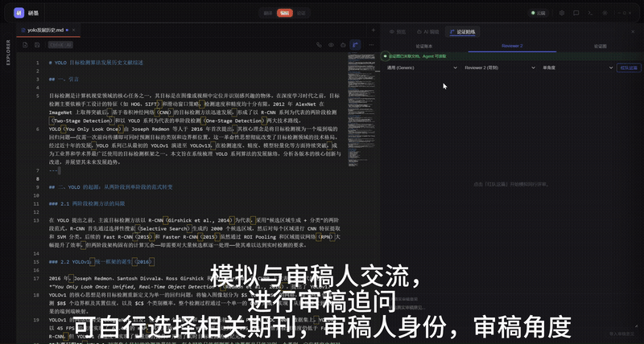
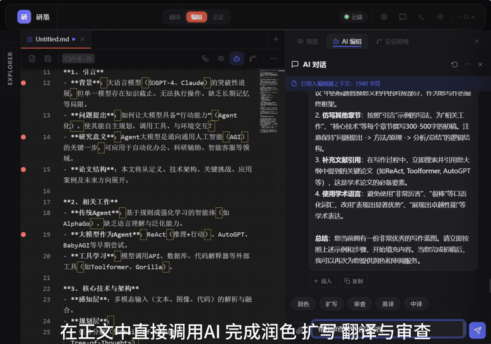
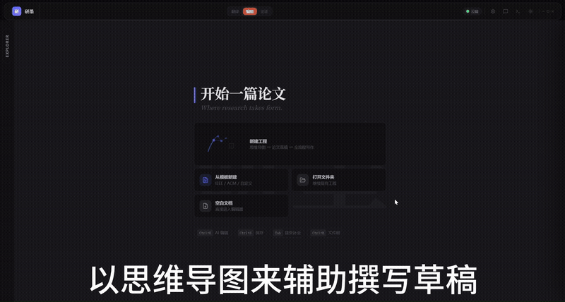
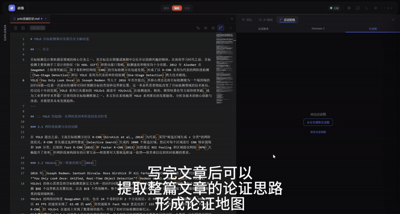

# Scholar Assistant

[](./LICENSE)
[](https://github.com/zuowen7/scholar-assistant-agent/actions)
[](https://github.com/zuowen7/scholar-assistant-agent/releases)

**English** | [中文](./README_zh.md)

> An open-source AI workstation for academic writing and submission. Write, review, think, and publish — all in one place.

- **Write** — AI companion editor with polish / expand / rewrite; Agent reads and writes project files directly (Claude Code for papers)
- **Review** — Reviewer-2 adversarial peer review + Claim Ledger to pressure-test logic before you submit
- **Think** — Mind map + Toulmin argument map to structure ideas and reasoning
- **Publish** — One-click export to IEEE / ACM / NeurIPS LaTeX templates and Word

PDF translation & close reading included as an on-ramp — translate a paper in minutes, then work on it. Voice assistant with Siri-style wake word and dictation. Runs locally offline or connects to 21 cloud LLM providers. **Bilingual UI** (zh-CN / en-US).

v0.3.6 — Latest: Siri-like voice command routing (20+ commands), bilingual UI. MIT license.

## Demo

| Review — Adversarial Peer Review | Review — Claim Ledger |
|----------------------------------|------------------------|
|  |  |

| Write — AI Editor + Agent |
|---------------------------|
|  |

| Think — Mind Map | Think — Argument Map |
|-------------------|----------------------|
|  |  |

| Voice — Wake Word + Dictation |
|------------------------------|
|  |

| More Features |
|---------------|
|  |

> All GIFs are real screen recordings from the v0.3.6 release.

## Download

Pre-built installers: [Releases](https://github.com/zuowen7/scholar-assistant-agent/releases) — Windows installer, macOS DMG, Linux AppImage/DEB.

> **Note**: [Ollama](https://ollama.com) is optional — only needed for local/offline translation. Cloud translation works out of the box with an API key.

## Core Features

### AI Editor (Agent as Backbone)

> **Positioning: Claude Code for Papers.** Treat your research project as a workspace; the Agent reads/writes PDFs, drafts, bib files, and data directly — just like Claude Code edits source code.

- **Agent Workspace File Tools** — Open a project folder; the Agent calls `read_file / grep_files / str_replace / write_file / git_op` directly on project files; editor tabs reload mid-stream after each Agent write; `read_file` auto-parses PDF/Word/EPUB
- **Document QA Short-circuit** — When a document is open and you ask "how is it / summarize / any issues", the content is already at hand — single-shot LLM streaming answer, no ReAct tool loop; only explicit "modify/save/run" intent triggers full Agent
- **Workspace Boundary & Approval** — All file operations locked to project root; out-of-scope access triggers an approval popup (Allow once / Allow session / Deny), matching Claude Code behavior
- **Copilot-style Inline Diff** — Agent file edits (`str_replace`/`write_file`) appear as inline decorations in the editor: red wavy underline on deleted text, green preview widget with [Accept][Reject] buttons below
- **ReAct Reasoning** — Multi-step tool-call loop with task decomposition, checkpoint resume, three-layer Skill injection (SOUL/AGENTS/IDENTITY), and context compression
- **Library (RAG)** — Post-translation auto-ingest bilingual full text into local vector DB; Agent calls `search_documents` on demand (not auto-injected per turn); manual upload/delete supported
- **AI Polish / Expand / Coherence / Compliance** — Operate on selected text via the AI Panel
- **Inline Ghost Text** — Monaco Editor auto-requests completions 1.5s after typing; Tab to accept

### Argument Companion (v3) & Argument Mapping (v2)

> **Your pre-submission pressure test.** AI proactively finds problems in your logic; you just respond.

- **Claim Ledger** — Auto-extract every promise from abstract/intro; track whether the body delivers (paid / partial / unpaid / mismatch), each anchored to exact character offsets; fuzzy relocation on edits (anchored → drifted → lost 3-state), like `git blame` for arguments
- **Reviewer‑2 Adversary** — 7 conference-calibrated simulated reviews (NeurIPS / ICML / ICLR / ACL / CVPR / KDD / CHI); each critique anchored to a specific sentence; author drafts rebuttal point-by-point; reviewer can be persuaded; 3-angle parallel review (method/experiment/writing) with auto dedup
- **Real Review Import** — Paste actual reviewer comments; AI structures them into rebuttal-ready items
- **Experiment Gap Suggestions** — For each unpaid/partial promise, AI proposes a concrete experiment design
- **Rebuttal Package Export** — One-click download of all critique points + rebuttal drafts as Markdown
- **Toulmin Argument Map** — Nodes (Claim / Grounds / Warrant / Backing / Qualifier / Rebuttal) + Relations on a Vue Flow canvas; AI auto-extraction, critique, and suggestions; flatten to structured Markdown/LaTeX paper draft (SSE streaming)

**Status**: Phase 0–5 complete, `features.argument_companion=true` shipped, 2048 pytest passed / 11 skipped + 482 vitest passed.

### Mind Map
- **Vue Flow Canvas** — Custom node cards + edges (tree/association), drag, zoom, minimap
- **Node Body Editing** — Each node has an expandable body textarea (▸ button); collapsed view shows first-line preview
- **Editor Bidirectional Sync** — Editor → mind map auto-parses heading + body; mind map → editor preserves all content (no data loss)
- **AI Smart Expand** — Generate subtopics based on selected node content
- **AI Logic Check** — Detect logic chain issues
- **Undo/Redo** — 100-step history stack, Ctrl+Z / Ctrl+Shift+Z
- **Auto Layout** — dagre algorithm, one-click organize
- **Keyboard Shortcuts** — Tab add child, Enter add sibling, F2 edit, Delete remove hovered edge, arrows navigate

### Translation Pipeline

> DeepL-quality PDF translation as an on-ramp — get papers into your workflow in minutes.

- **Smart PDF Parsing** — 16 format parsers, auto-detect single/dual-column layout
- **Text Cleaning** — 17-stage pipeline: fix line breaks, remove watermarks/headers/footers, handle hyphenation
- **Reference Skip** — Auto-detect REFERENCES/BIBLIOGRAPHY sections, preserve as-is
- **DeepL-like Experience** — Side-by-side bilingual view + sentence-level hover highlighting with precise alignment
- **Real-time Progress** — SSE streaming 5-step pipeline progress, live paragraph preview
- **Failed Block Retry** — Retry individual failed blocks without re-translating the entire document
- **Multi-format Export** — Bilingual/translation-only × Markdown/Word (4 formats) + PPTX

### Translation Engines
- **Local** — Ollama + Qwen3, fully offline, no API key needed
- **Cloud** — OpenAI / Anthropic / DeepSeek / Moonshot / Zhipu / Qwen / Gemini / SiliconFlow / OpenRouter / Groq / Together / Mistral / xAI / Fireworks / DeepInfra / Perplexity / Novita / Volcengine / Baidu Qianfan / Azure / Custom (21 providers)
- **Enhanced Prompts** — Strict paragraph structure preservation, reduced alignment failures
- **Glossary Auto-extraction** — Extract `Chinese(English)` term pairs from translated text, inject into subsequent chunks
- **Sliding Context Window** — Each chunk carries summaries and terminology from preceding chunks

### Voice Assistant

> **Siri for academic writing** — Say the wake word or press Alt+Shift+V, the Siri overlay appears, speak a command to jump directly to features.

- **Voice Command Router** — Keyword-classified 20+ commands across 5 tiers: navigation (translate/editor/argument/mindmap/theme), file ops (save/new/open), editor (export/polish/expand/review/translate/compliance/citations), translation pipeline (new/retry/export Word/PPTX), mind map (add/delete node/AI expand/layout/zoom); unmatched text falls back to Agent chat
- **Wake Word** — Web Speech API continuous recognition with homophone variant matching; 5-second cooldown; customizable in settings
- **Global Hotkey** — `Alt+Shift+V` system-wide (Tauri plugin); works even when window is minimized
- **Siri-style Voice UI** — fullscreen glass-morphism overlay with pulsing orb + ripple rings + live transcript; 2-second silence auto-submit; shows matched command feedback
- **Voice Dictation** — mic buttons in editor toolbar, Agent panel, and AI panel; accepts Ghost Text (Tab) mid-speech without losing context
- **Conflict-free Design** — wake word detection auto-pauses during dictation; no microphone contention

### Editor
- **Monaco Editor** — Full-featured code editor with Markdown syntax highlighting
- **AI Panel** — Chat-style UI with message history; polish/expand results shown as diff view, one-click apply/undo
- **File Tree** — Multi-file management with left sidebar navigation
- **Template Export** — Pandoc compilation with IEEE / ACM / NeurIPS / LNCS / Elsevier / Generic LaTeX templates

### Debugging & Observability
- **File Logging** — Backend logs written to `RUNTIME_DIR/logs/app.log` (10 MB × 5 rotating backups, each line carries trace_id)
- **Access Logging** — Every HTTP request logged with method / path / status / duration
- **Debug Panel** — Top-bar Terminal icon button; shows frontend error history (timestamp + level) and backend logs; red badge when unread errors exist

### Deployment
- **Desktop** — Tauri 2 packaged; auto-manages Python backend and Ollama processes
- **Offline Ready** — Release installer bundles Pandoc / Tectonic (with pre-warmed LaTeX cache) / all-MiniLM-L6-v2 embedding model; first-launch seeds to user cache; PDF export and library work offline; default translation engine is cloud (user provides API key)
- **Docker** — Multi-stage build, one-command containerized deployment
- **Python CLI** — `python main.py paper.pdf -o paper.md`

## Project Structure

```
├── src-tauri/                    # Rust + Tauri desktop
│   ├── src/main.rs               #   Process management (Python API + Ollama, auto-clear proxy env vars)
│   └── capabilities/             #   Tauri v2 permission configuration
├── src/                          # Vue 3 frontend
│   ├── App.vue                   #   Main shell (~684 lines, global state management)
│   ├── styles/tokens.css         #   Design Tokens (dark/light themes)
│   ├── composables/
│   │   ├── useTranslate.ts       #   SSE translation pipeline state (singleton)
│   │   ├── useAgentChat.ts       #   Agent SSE chat state (singleton)
│   │   ├── useEditor.ts          #   Monaco Editor + AI Panel (singleton)
│   │   ├── useFileTree.ts        #   File tree navigation (singleton)
│   │   ├── useMindMap.ts         #   Mind map data + undo/redo (singleton)
│   │   ├── useArgumentMap.ts     #   Toulmin v2 graph state (singleton)
│   │   ├── useArgumentCompanion.ts # Argument Companion ledger state (singleton)
│   │   ├── useSpeechRecognition.ts # Web Speech API (accumulation, dedup, punctuation merge)
│   │   ├── useSpeechBusy.ts      #   Shared busy flag (wake word ↔ dictation conflict prevention)
│   │   ├── useWakeWord.ts        #   Wake word detection (continuous SR, homophone matching, cooldown)
│   │   ├── useGlobalHotkey.ts    #   System hotkey registration (Tauri plugin, Alt+Shift+V)
│   │   ├── useVoiceCommand.ts    #   Voice command state machine + auto-submit
│   │   ├── useVoiceRouter.ts     #   Siri-like intent router (keyword classification + command dispatch)
│   │   ├── useAppMode.ts         #   Global mode/panel state (singleton)
│   │   └── voiceCommands/        #   Declarative command registry (5 tiers, 20+ commands)
│   ├── components/
│   │   ├── AppTopBar.vue         #   Top bar (brand / mode switch / settings / voice settings / window controls)
│   │   ├── TranslateView.vue     #   Translation mode (upload / progress / result views)
│   │   ├── AgentPanel.vue        #   Agent side panel (chat / library / templates / sessions)
│   │   ├── EditorLayout.vue      #   Editor layout (~657 lines, Monaco + AiPanel + FileTree)
│   │   ├── VoiceAssistantView.vue #   Siri-style fullscreen voice UI (glass morphism, pulse/ripple animation)
│   │   ├── mindmap/              #   Mind map (Vue Flow canvas + custom nodes/edges)
│   │   ├── ui/                   #   UI primitives (Button/Input/Panel/Tooltip…)
│   │   └── …                     #   MonacoEditor, AiPanel, ArgumentMap, etc.
│   ├── i18n/                     #   Internationalization (vue-i18n v11, zh-CN + en-US ~790 keys each)
│   ├── utils/
│   │   ├── api.ts                #   API base URL (auto-detect Tauri vs web)
│   │   └── streamReader.ts       #   Unified SSE stream parser (6 call sites)
│   └── types/index.ts            #   Shared TypeScript types
├── python/                       # Python backend
│   ├── api_factory.py            #   FastAPI app factory (core logic only)
│   ├── routers/                  #   Route modules (split by function)
│   │   ├── translate.py          #   Translation / config / health check routes
│   │   ├── agent.py              #   Agent chat / RAG / tool routes
│   │   ├── editor.py             #   Edit / export / Vision / Citation routes
│   │   ├── argument.py           #   Argument map + Companion v3 routes
│   │   └── mindmap.py            #   Mind map persistence + AI analysis/expand
│   ├── src/
│   │   ├── parser/               #   16 format parsers
│   │   ├── cleaner/              #   17-stage cleaning pipeline
│   │   ├── chunker/              #   3 chunking strategies (sentence/paragraph/fixed)
│   │   ├── translator/           #   Ollama + Cloud dual-client (21 providers)
│   │   ├── formatter/            #   3 output modes + Pandoc export
│   │   ├── agent/                #   ReAct Agent + RAG + Tools + Skills + Memory
│   │   ├── argument/             #   Argument Map v2 + Companion v3
│   │   ├── plugin/               #   MCP-style plugin registry
│   │   ├── citation/             #   Citation indexer
│   │   ├── zotero/               #   Zotero API integration
│   │   └── mcp/                  #   Vision client (multi-modal image analysis)
│   ├── prompts/                  #   Academic writing prompt system (6-layer skeleton + YAML frontmatter)
│   ├── data/paper_assets/        #   Paper templates (IEEE/ACM/NeurIPS/LNCS/Generic)
│   └── tests/                    #   Unit + integration tests (incl. E2E companion + adversarial), pytest 2048 passed / 11 skipped
├── config/default.yaml           #   Source-of-truth default configuration
├── Dockerfile
├── docker-compose.yml
└── package.json
```

## Quick Start

### Prerequisites

- Python 3.12+
- [Ollama](https://ollama.ai) + Qwen3 model (`ollama pull qwen3:8b`)
- Node.js 18+, Rust 1.80+ (for desktop development)

### Desktop App (Tauri)

```bash
npm install

# Dev mode (auto-clears proxy env vars to prevent httpx import hang)
start_dev.bat
# Or manually clear proxy and run
npx tauri dev

# Production build
npx tauri build
```

The app auto-starts the Python API service and cleans up all subprocesses on window close.

### Python Backend Only

```bash
cd python
pip install -r requirements.txt
ollama serve                                    # Start Ollama
python api.py --port 18088                      # Start API server
# Or use CLI
python main.py paper.pdf -o paper.md
```

### Docker

```bash
docker compose --project-name scholar-assistant build

OLLAMA_HOST=0.0.0.0:11434 ollama serve

# Windows (Git Bash)
MSYS_NO_PATHCONV=1 docker run --rm \
  -v "$(pwd)/python/data/input:/data/input:ro" \
  -v "$(pwd)/python/data/output:/data/output" \
  --add-host=host.docker.internal:host-gateway \
  scholar-assistant-app:latest \
  /data/input/paper.pdf -o /data/output/paper.md
```

## API Reference

Translation SSE event order: `progress` → `parsed` → `cleaned` → `chunked` → `chunk_done`(×N) → `complete`

### Translation
| Method | Path | Description |
|--------|------|-------------|
| `POST` | `/api/translate` | Upload document, returns task_id |
| `POST` | `/api/translate/path` | Translate from file path |
| `GET` | `/api/translate/{id}/stream` | SSE translation progress stream |
| `GET` | `/api/download/{id}` | Download translation result |

### Engine Status
| Method | Path | Description |
|--------|------|-------------|
| `GET` | `/api/health` | Health check |
| `GET` | `/api/ollama/status` | Ollama status |
| `GET` | `/api/cloud/status` | Cloud API status |
| `GET` | `/api/cloud/providers` | List available providers |

### Configuration
| Method | Path | Description |
|--------|------|-------------|
| `GET` | `/api/config` | Read config |
| `PUT` | `/api/config` | Write config |

### Agent & Editor
| Method | Path | Description |
|--------|------|-------------|
| `POST` | `/api/chat` | Agent SSE chat (ReAct loop) |
| `POST` | `/api/agent/v2/chat` | Agent V2 SSE chat (session management) |
| `GET` | `/api/agent/v2/sessions` | List session history |
| `POST` | `/api/agent/v2/resume/{session_id}` | Resume session |
| `POST` | `/api/agent/v2/approve/{session_id}/{event_id}` | Approve tool call |
| `POST` | `/api/agent/v2/abort/{session_id}` | Abort session |
| `POST` | `/api/agent/v2/undo/{session_id}` | Undo last step |
| `POST` | `/api/agent/v2/tool` | Direct tool call |
| `POST` | `/api/edit` | AI-powered SSE streaming edit |
| `POST` | `/api/complete` | Non-streaming inline completion |
| `GET` | `/api/agent/stats` | Agent statistics |

### RAG Library
| Method | Path | Description |
|--------|------|-------------|
| `GET` | `/api/rag/documents` | List RAG documents |
| `POST` | `/api/rag/upload` | Upload file to RAG |
| `POST` | `/api/rag/ingest` | Ingest text into RAG |
| `DELETE` | `/api/rag/documents/{doc_id}` | Delete RAG document |

### Argument Map (v2)
| Method | Path | Description |
|--------|------|-------------|
| `POST` | `/api/argument/graph` | Create argument graph |
| `GET` | `/api/argument/graph/{gid}` | Get argument graph |
| `GET` | `/api/argument/graphs` | List all argument graphs |
| `DELETE` | `/api/argument/graph/{gid}` | Delete argument graph |
| `PUT` | `/api/argument/graph/{gid}/node` | Create/update node |
| `DELETE` | `/api/argument/graph/{gid}/node/{nid}` | Delete node |
| `PUT` | `/api/argument/graph/{gid}/edge` | Create/update edge |
| `DELETE` | `/api/argument/graph/{gid}/edge/{eid}` | Delete edge |
| `PUT` | `/api/argument/graph/{gid}/span` | Create source text binding |
| `DELETE` | `/api/argument/graph/{gid}/span/{sid}` | Delete source text binding |
| `POST` | `/api/argument/graph/{gid}/extract` | SSE extract Toulmin argument graph |
| `POST` | `/api/argument/graph/{gid}/critique` | AI critique |
| `POST` | `/api/argument/graph/{gid}/suggest` | AI suggest next element |
| `POST` | `/api/argument/graph/{gid}/flatten` | SSE flatten to paper draft |

### Writing
| Method | Path | Description |
|--------|------|-------------|
| `GET` | `/api/paper-assets/templates` | List paper templates |
| `POST` | `/api/paper-assets/ingest` | Index template assets |
| `POST` | `/api/paper-scaffold` | Generate paper outline |
| `POST` | `/api/paper-style-transfer` | Style transfer |
| `POST` | `/api/compliance` | Compliance check |

### Export
| Method | Path | Description |
|--------|------|-------------|
| `GET` | `/api/export/templates` | List export templates |
| `POST` | `/api/export` | Export document (LaTeX/PDF) |
| `POST` | `/api/export/pdf` | Export as PDF |
| `POST` | `/api/export/word` | Export as Word (.docx) |
| `GET` | `/api/export/word/{filename}` | Download Word export |

### Vision
| Method | Path | Description |
|--------|------|-------------|
| `POST` | `/api/vision/analyze` | General image analysis |
| `POST` | `/api/vision/ocr` | OCR text extraction |
| `POST` | `/api/vision/chart` | Chart analysis |
| `POST` | `/api/vision/table` | Table structure extraction |

### Argument Companion (v3)
| Method | Path | Description |
|--------|------|-------------|
| `POST` | `/api/companion/ledger/build` | SSE build claim ledger (anchor* → promise* → complete) |
| `GET` | `/api/companion/ledger?doc_id=` | Get ledger |
| `PUT` | `/api/companion/ledger/promise?doc_id=` | Add/update promise |
| `DELETE` | `/api/companion/ledger/promise/{pid}?doc_id=` | Delete promise |
| `POST` | `/api/companion/ledger/relocate?doc_id=` | Relocate all anchors after edits |
| `POST` | `/api/companion/ledger/promise/{pid}/suggest-experiment?doc_id=` | Experiment gap suggestion |
| `POST` | `/api/companion/review` | SSE simulated review (review_point* → complete); `mode: "parallel"` for 3-angle |
| `GET` | `/api/companion/review/{session_id}` | Get review session |
| `GET` | `/api/companion/reviews` | List document review history |
| `PUT` | `/api/companion/review/{sid}/point/{pid}` | Update critique point status |
| `POST` | `/api/companion/review/{sid}/point/{pid}/rebut` | SSE rebuttal (reviewer can be persuaded) |
| `POST` | `/api/companion/review/import` | SSE import real review comments |
| `GET` | `/api/companion/download/review/{session_id}` | Download rebuttal Markdown package |
| `DELETE` | `/api/companion/review/{session_id}` | Delete review session |

### Mind Map
| Method | Path | Description |
|--------|------|-------------|
| `POST` | `/api/mindmap/save` | Save mind map |
| `GET` | `/api/mindmap/load` | Load mind map |
| `DELETE` | `/api/mindmap` | Delete mind map |
| `POST` | `/api/mindmap/analyze` | AI analyze mind map |
| `POST` | `/api/mindmap/expand` | AI expand node |

### Zotero
| Method | Path | Description |
|--------|------|-------------|
| `GET` | `/api/zotero/status` | Connection status |
| `POST` | `/api/zotero/search` | Search Zotero library |
| `GET` | `/api/zotero/item/{key}` | Get item metadata |
| `GET` | `/api/zotero/item/{key}/bibtex` | Get BibTeX |
| `POST` | `/api/zotero/export` | Export items to file |
| `POST` | `/api/zotero/citations` | Extract citations |

### Debugging
| Method | Path | Description |
|--------|------|-------------|
| `GET` | `/api/logs` | Return last N lines of backend log + log file path |

### Other
| Method | Path | Description |
|--------|------|-------------|
| `GET` | `/api/plugins` | List registered plugin tools |
| `GET` | `/api/tectonic/status` | LaTeX engine status |
| `POST` | `/api/tectonic/install` | Install Tectonic |
| `PUT` | `/api/citation/index` | Index citations |
| `GET` | `/api/citation/extract` | Extract citations |
| `POST` | `/api/upload/image` | Upload image |
| `GET` | `/api/assets/{filename}` | Get asset file |

## Configuration

Edit `config/default.yaml`:

| Key | Default | Description |
|-----|---------|-------------|
| `parser.engine` | pdfplumber | PDF parsing engine |
| `chunker.max_tokens` | 800 | Max tokens per chunk (was 2048, too large caused alignment fallback) |
| `chunker.strategy` | sentence | Chunking strategy |
| `translator.engine` | cloud | Translation engine: ollama / cloud |
| `translator.model` | qwen3:8b | Ollama model |
| `translator.temperature` | 0.3 | Generation temperature |
| `translator.timeout` | 300 | Translation timeout (seconds) |
| `formatter.output_format` | bilingual | Output format |
| `agent.enabled` | true | Whether Agent is enabled |
| `rag.enabled` | true | Whether RAG is enabled (local only) |
| `features.parallel_review` | false | 3-angle parallel review (enable in `default.local.yaml`) |

## Architecture

```
┌─────────────────────────────────────────────────┐
│  Vue 3 + TypeScript + Monaco Editor + Vue Flow  │
│              (Vite dev server)                   │
├─────────────────────────────────────────────────┤
│  Tauri 2 (Rust) — desktop shell, process mgmt   │
├─────────────────────────────────────────────────┤
│  Python FastAPI + SSE                            │
│  ┌──────────┬──────────┬──────────┬───────────┐ │
│  │ Translate │  Agent   │ Argument │ Mind Map  │ │
│  │ Pipeline  │  ReAct   │ Companion│  CRUD+AI  │ │
│  └──────────┴──────────┴──────────┴───────────┘ │
│  ┌──────────┬──────────┬───────────────────────┐ │
│  │  Parser   │ Cleaner  │ Chunker │ Formatter  │ │
│  │ (16 fmts) │(17 stages)│(3 strats)│(Pandoc)  │ │
│  └──────────┴──────────┴───────────────────────┘ │
├─────────────────────────────────────────────────┤
│  LLM Backends: Ollama (local) | 21 cloud APIs   │
└─────────────────────────────────────────────────┘
```

### Key Design Decisions

- **No LangChain / LlamaIndex** — hand-written ReAct engine for full control
- **SSE everywhere** — streaming UX for translation, agent chat, argument extraction
- **Local-first** — all data stays on your machine; cloud LLMs are optional
- **Workspace-scoped Agent** — file operations locked to project root, with approval for escapes

## 21 Cloud LLM Providers

OpenAI, Anthropic, DeepSeek, Moonshot, Zhipu (ChatGLM), Qwen (Tongyi), Gemini, SiliconFlow, OpenRouter, Groq, Together, Mistral, xAI, Fireworks, DeepInfra, Perplexity, Novita, Volcengine (Doubao), Baidu Qianfan, Azure OpenAI, and custom endpoints.

## Argument Companion (Reviewer-2)

A unique feature not found in any other academic tool:

- **Claim Ledger** — automatically extracts promises from abstract/intro and tracks whether the body delivers on each one (paid / partial / unpaid), anchored to exact character offsets with fuzzy relocation on edits
- **Reviewer-2 Simulation** — calibrated reviews for 7 conferences (NeurIPS, ICML, ICLR, ACL, CVPR, KDD, CHI), with rebuttal mini-chat where the reviewer can be persuaded
- **Parallel Perspectives** — method / experiment / writing angles reviewed concurrently via `asyncio.gather`
- **Real Review Import** — paste actual reviewer comments, get structured rebuttal items

## Testing

```
Python:  2048 tests passed / 11 skipped  (pytest)
Frontend: 482 tests passed / 40 files    (vitest)
```

```bash
cd python && pytest tests/ -v    # Backend tests
npx vitest                       # Frontend tests
```

## Tech Stack

| Layer | Technology |
|-------|------------|
| Frontend | Vue 3, TypeScript, Vite, Monaco Editor, Vue Flow |
| Desktop | Tauri 2 (Rust) |
| Backend | Python 3.12, FastAPI, SSE |
| Local LLM | Ollama + Qwen3:8b |
| Cloud LLM | 21 providers via OpenAI-compatible API |
| PDF | PyMuPDF, pdfplumber |
| Vector DB | ChromaDB + all-MiniLM-L6-v2 |
| Export | Pandoc + 6 LaTeX templates (IEEE/ACM/NeurIPS/LNCS/Generic) + Tectonic |

## Contributing

Contributions are welcome! Here's how to get started:

1. Fork the repo and create a feature branch
2. Make your changes — add tests for new functionality
3. Run `pytest tests/ -v` and `npx vitest` to verify
4. Submit a pull request

Good first issues are tagged `good-first-issue`. The project structure is documented in [CLAUDE.md](./CLAUDE.md).

## License

[MIT](./LICENSE)

---

Built with Tauri, FastAPI, and too many late nights.

---

If this helps your research workflow, please star the repo. PRs and issues welcome.
